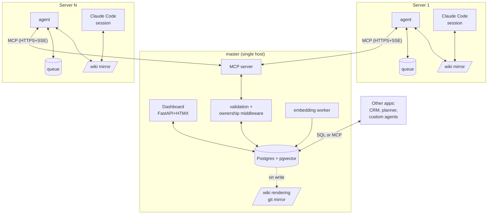

# VaultMCP — design

**Implementation-ready architecture for VaultMCP v0.1.**

This document is what you'd hand to an engineer starting to build VaultMCP. It specifies the components, MCP tool signatures, DB schema (core + extension namespaces), conflict semantics, offline behavior, security, vector search, dashboard, and a phased build plan. No further design work should be necessary; what's left is code.

For the why, read [`README.md`](README.md) and [`docs/01-vision.md`](docs/01-vision.md). For VaultMCP vs VaultMesh, read [`docs/02-vs-vaultmesh.md`](docs/02-vs-vaultmesh.md). For extending the DB, read [`docs/03-extensibility.md`](docs/03-extensibility.md). For the dashboard, read [`docs/04-dashboard.md`](docs/04-dashboard.md).

---

## 1. Goals & non-goals

### Goals

- **G1.** Eliminate manual sync discipline (no `vs`/`vp`).
- **G2.** Real-time propagation: a write on one server is visible on every other server within 1–3 seconds.
- **G3.** Local-first reads. Sessions read from a local file mirror; never from the network.
- **G4.** Standardized API: any MCP-aware agent integrates without filesystem access.
- **G5.** Server-side enforcement of ownership, frontmatter, and secret patterns at write time.
- **G6.** Native semantic search via pgvector at master (not optional).
- **G7.** Extensible shared DB — other applications add their own tables alongside the wiki, share the embedding store, share auth and audit infrastructure (pattern inspired by OB1).
- **G8.** Built-in dashboard for live activity, search, audit.
- **G9.** Optional preserved git history (master commits each MCP write).
- **G10.** Graceful upgrade path from VaultMesh.

### Non-goals

- **N1.** User-to-user real-time messaging.
- **N2.** Replacing Postgres with a database-of-the-week. Postgres+pgvector is the choice.
- **N3.** Multi-master in v0.1.
- **N4.** Cross-organization federation. Out of scope.
- **N5.** Strong consistency. Eventually consistent on a tight bound (seconds).
- **N6.** Heavy frontend framework. Dashboard is FastAPI + HTMX, deliberately simple.

---

## 2. Architecture



Five components on master:

- **Postgres + pgvector** — authoritative storage. Wiki content, embeddings, audit, events, extensions.
- **MCP server** — read/write API for agents.
- **Validation middleware** — ownership, frontmatter, secret patterns; runs in front of every write.
- **Embedding worker** — background process that computes embeddings on writes.
- **Dashboard** — FastAPI+HTMX web UI on a separate port.
- **Wiki rendering / git mirror** — files projected from DB rows for human inspection and git history.

Two pieces per client server:

- **Agent** — file watcher → MCP write; subscribe → apply local; queue when offline.
- **Local file mirror** — full copy of the wiki on disk for instant reads and editor compatibility.

---

## 3. Storage model: DB-first

### 3.1 Source of truth

**Postgres is the source of truth.** Files are a projection.

This is a deliberate inversion of VaultMesh (where files are primary, git is transport). The reasons:

- Other applications need a structured, queryable view of the wiki. SQL beats markdown parsing.
- Embeddings update transactionally with content. No watcher-lag, no inconsistent index.
- Audit, events, extensions, vector search — all live in the same DB, queryable together.
- Other apps (the OB1-style "extensions") plug into the same DB without going through MCP for everything.

### 3.2 The flow

```
1. Agent on Server A:    file watcher fires after local edit
2. Agent →  Master:      MCP wiki.write(path, content, base_version)
3. Master:               validation middleware (ownership, frontmatter, secrets)
4. Master:               INSERT INTO pages (within transaction)
5. Master:               enqueue embedding job
6. Master:               COMMIT; BROADCAST event to subscribed agents
7. (background) worker:  compute embedding, UPSERT INTO embeddings
8. (optional) renderer:  write wiki/<path> to disk + git commit (for history)
9. Agents:               receive PageChanged event, apply to local file mirror
```

### 3.3 Core schema

The schema VaultMCP owns. Other apps must not modify these tables.

```sql
-- Wiki content
CREATE TABLE pages (
  path                TEXT PRIMARY KEY,         -- e.g. "apps/inventory/README.md"
  content             TEXT NOT NULL,
  version             BIGINT NOT NULL,          -- per-page monotonic
  global_version      BIGINT NOT NULL,          -- monotonic across all pages
  metadata            JSONB NOT NULL,           -- frontmatter parsed
  type                TEXT NOT NULL,            -- enum: app|integration|flow|adr|log|index|module|debugging|runbook|shared
  owners              TEXT[] NOT NULL,
  updated             TIMESTAMPTZ NOT NULL,
  last_writer_server  TEXT NOT NULL,
  last_writer_app     TEXT NOT NULL,
  last_writer_session TEXT NOT NULL
);
CREATE INDEX pages_type_idx ON pages(type);
CREATE INDEX pages_owners_idx ON pages USING gin(owners);
CREATE INDEX pages_global_version_idx ON pages(global_version);

CREATE SEQUENCE global_version_seq;

-- Embeddings (pgvector)
CREATE EXTENSION IF NOT EXISTS vector;

CREATE TABLE embeddings (
  path             TEXT PRIMARY KEY REFERENCES pages(path) ON DELETE CASCADE,
  page_version     BIGINT NOT NULL,
  embedding        VECTOR(1536),                -- text-embedding-3-small dim
  embedding_model  TEXT NOT NULL,
  computed_at      TIMESTAMPTZ NOT NULL
);
CREATE INDEX embeddings_idx ON embeddings USING ivfflat (embedding vector_cosine_ops);

-- Append-only log (the message-bus role)
CREATE TABLE log_entries (
  id                    BIGSERIAL PRIMARY KEY,
  ts                    TIMESTAMPTZ NOT NULL,
  server_id             TEXT NOT NULL,
  app                   TEXT NOT NULL,
  modules_touched       TEXT[],
  integrations_updated  TEXT[],
  notable               TEXT[]
);
CREATE INDEX log_ts_idx ON log_entries(ts DESC);
CREATE INDEX log_server_idx ON log_entries(server_id, ts DESC);

-- Audit (every operation)
CREATE TABLE audit (
  id              BIGSERIAL PRIMARY KEY,
  ts              TIMESTAMPTZ NOT NULL,
  operation       TEXT NOT NULL,                -- read|write|delete|subscribe|append_log|search
  path            TEXT,
  server_id       TEXT NOT NULL,
  app             TEXT NOT NULL,
  agent_model     TEXT,
  prompt_hash     TEXT,
  version_before  BIGINT,
  version_after   BIGINT,
  outcome         TEXT NOT NULL,                -- ok|conflict|forbidden|validation_failed
  error_code      TEXT,
  client_ip       INET
);
CREATE INDEX audit_path_ts_idx ON audit(path, ts DESC);
CREATE INDEX audit_server_ts_idx ON audit(server_id, ts DESC);

-- Events (for dashboard live feed and external consumers via LISTEN/NOTIFY)
CREATE TABLE events (
  id              BIGSERIAL PRIMARY KEY,
  ts              TIMESTAMPTZ NOT NULL,
  event_type      TEXT NOT NULL,                -- PageChanged|PageDeleted|LogAppended|...
  path            TEXT,
  global_version  BIGINT NOT NULL,
  payload         JSONB
);
CREATE INDEX events_ts_idx ON events(ts DESC);
CREATE INDEX events_global_version_idx ON events(global_version DESC);

-- Subscriptions (per-agent stream cursors)
CREATE TABLE subscriptions (
  agent_id              TEXT PRIMARY KEY,
  server_id             TEXT NOT NULL,
  last_global_version   BIGINT NOT NULL,
  connected_at          TIMESTAMPTZ NOT NULL,
  prefix_filter         TEXT
);

-- Authorized servers + tokens (token hashed, never stored plaintext)
CREATE TABLE servers (
  id              TEXT PRIMARY KEY,             -- e.g. "server-1"
  apps            TEXT[] NOT NULL,
  token_hash      TEXT NOT NULL,
  rotated_at      TIMESTAMPTZ NOT NULL
);

-- Extension registry (see docs/03-extensibility.md)
CREATE TABLE extensions (
  name            TEXT PRIMARY KEY,             -- e.g. "crm", "meal_planner"
  schema_prefix   TEXT NOT NULL UNIQUE,         -- e.g. "ext_crm_"
  owners          TEXT[] NOT NULL,
  registered_at   TIMESTAMPTZ NOT NULL,
  policy          JSONB NOT NULL                -- read/write rules
);
```

### 3.4 Wiki rendering (files on master)

After every write, master writes (or git-commits) the corresponding markdown file at `/var/lib/vaultmcp/wiki/<path>`. This:

- Lets humans browse the wiki with `cat`, `less`, any editor
- Lets the master serve the optional git remote (for VaultMesh-mode clients)
- Provides a recoverable backup if Postgres ever gets corrupted

The renderer is synchronous within the write transaction (so files are never out of sync with DB on master). Failure to write a file fails the whole write — the DB transaction rolls back.

### 3.5 Agent storage

Per server:

```
~/vault/
├── wiki/                       local mirror, full copy
└── .vaultmcp/
    ├── token                   bearer token (chmod 600)
    ├── version-cache.db        SQLite — last known version per file
    ├── queue/                  pending writes (offline mode)
    ├── master.url              cached master URL
    └── agent.log               structured logs
```

The agent's local mirror is a full mirror — every server has a copy of every page, not just the ones it owns. Reads are local. Writes go through MCP.

### 3.6 Read vs write boundaries

Storage uniform; permissions scoped at master.

| | Server 1 (webstore+admin) | Server 2 (inventory+aggregator) | Server 3 (pos) |
|---|---|---|---|
| Stores locally | full wiki | full wiki | full wiki |
| Allowed to **read** | everything | everything | everything |
| Allowed to **write** | `apps/webstore/**`, `apps/admin/**`, `integrations/03-...`, log | `apps/inventory/**`, `apps/aggregator/**`, `integrations/01-...` (producer), `02-...` Consumer notes, log | `apps/pos/**`, `integrations/02-...` (producer), `01-...` Consumer notes, log |

---

## 4. MCP tool schema

### `wiki.read`

```typescript
input: { path: string }

output: {
  path: string
  content: string
  version: number
  global_version: number
  metadata: {
    type: PageType
    owners: string[]
    updated: string
    last_writer_server: string
    last_writer_session: string
  }
}

errors: 404 NotFound, 403 Forbidden
```

### `wiki.write`

```typescript
input: {
  path: string
  content: string
  base_version: number | null   // null for new file
  session: {
    server_id: string
    app: string                 // must match path's owner
    agent_model: string
    prompt_hash?: string
  }
}

output: {
  path: string
  version: number
  global_version: number
  applied_at: string
}

errors:
  409 Conflict       → response includes {current_version, current_content, last_writer}
  403 Forbidden      → ownership rule violation
  422 Unprocessable  → frontmatter or secret pattern violation (pattern name in error, not value)
  507 InsufficientStorage
```

### `wiki.list`

```typescript
input: {
  prefix?: string
  type?: PageType
  updated_since?: string
}

output: {
  entries: Array<{
    path: string
    type: PageType
    owners: string[]
    updated: string
    version: number
  }>
  next_cursor?: string
}
```

### `wiki.search`

Required (pgvector is part of the base install). Three modes.

```typescript
input: {
  query: string
  mode?: "lexical" | "semantic" | "hybrid"   // default: "hybrid"
  limit?: number                              // default 10, max 50
  prefix?: string
  filters?: {
    type?: PageType[]
    owners?: string[]
    updated_since?: string
  }
}

output: {
  hits: Array<{
    path: string
    snippet: string                           // ~200 chars around the match
    score: number                             // 0..1
    matched_via: "title" | "body" | "frontmatter" | "embedding"
  }>
}
```

Hybrid mode uses Reciprocal Rank Fusion (RRF) with k=60 to combine lexical (Postgres `tsvector`/BM25) and semantic (pgvector cosine distance) rankings.

### `wiki.append_log`

```typescript
input: {
  entry: {
    timestamp: string                         // ISO-8601
    server_id: string
    app: string
    modules_touched: string[]
    integrations_updated: string[]
    notable: string[]
  }
}
output: { id: number, global_version: number }
```

Bypasses per-page version etag (log is append-only).

### `wiki.subscribe`

SSE streaming endpoint.

```typescript
input: {
  prefix?: string
  since_global_version?: number
}

output (stream):
  - { event: "PageChanged",  path, version, global_version, content, metadata }
  - { event: "PageDeleted",  path, version, global_version }
  - { event: "LogAppended",  id, entry, global_version }
  - { event: "Heartbeat",    server_time }     // every 30s
```

### `wiki.audit`

```typescript
input: { path?, since?, server_id?, app?, limit? }
output: { events: Array<AuditEntry> }
```

### Extension tools (`ext.*`)

See [`docs/03-extensibility.md`](docs/03-extensibility.md) for the full guide. Summary:

```typescript
ext.register(name, schema_prefix, policy) → { ok }
ext.declare_table(name, table_name, columns) → { ok }
ext.query(name, sql, params) → { rows }
ext.embed(name, path, content) → { computed_at }
```

---

## 5. Conflict semantics

Optimistic concurrency control via version etags. Standard pattern (HTTP `If-Match`, etcd, Consul, S3 conditional writes).

### Read-then-write loop (happy path)

```
Client A:
  read("apps/inv/README.md")  → {content: X, version: 42}
  (modifies X to Y)
  write("apps/inv/README.md", Y, base_version=42)
  → {version: 43, global_version: 12345, applied_at: ...}
```

### Conflict (rare with ownership)

```
Client A:
  read("apps/inv/README.md") → {content: X, version: 42}
  (slow human edit)

Client B:
  read("apps/inv/README.md") → {content: X, version: 42}
  (fast edit)
  write(...)                 → {version: 43}

Client A:
  write("apps/inv/README.md", Y, base_version=42)
  → 409 Conflict
     {current_version: 43, current_content: Z, last_writer: "server-2"}

Agent A:
  - Replaces local content with Z (master's truth)
  - Notifies session: "conflict on apps/inv/README.md, master is now Z; your changes were Y"
  - Session decides: apply Y on top of Z (LLM merges), abort, or surface to human
```

In practice, with VaultMesh-style ownership rules, conflicts are rare. They mostly happen when:

- Two agents legitimately edit the same Consumer notes section of an integration page
- Two operators edit the same module on the same server simultaneously

Master should expose a metric `vaultmcp_write_conflicts_per_hour`.

### Special cases

- **Log appends** — bypass etag. Multiple appends always succeed; master interleaves by `ts`.
- **New file** — `base_version=null` means "create". 409 if file already exists.
- **Delete** — out of scope for v0.1. Pages can be marked `status: deleted` in frontmatter.

---

## 6. Offline mode

The agent absorbs the difference between "master is online" and "master is offline".

### Reads

Always served from local mirror. Never network.

### Writes when master is reachable

1. Local file changes (file watcher fires).
2. Agent calls `wiki.write` with `base_version` from local cache.
3. On success, agent updates local version cache.
4. On 409, fetches master's version, replaces local content, notifies session.
5. On 5xx or network error: enqueue and retry.

### Writes when master is unreachable

1. Local file changes.
2. Agent enqueues a JSON envelope under `.vaultmcp/queue/`:

```json
{
  "id": "uuid",
  "timestamp": "2026-05-09T10:23:04.123Z",
  "path": "apps/inv/modules/X.md",
  "content": "...",
  "base_version": 42,
  "session": { "server_id": "...", "app": "...", "agent_model": "..." }
}
```

3. Agent retries every 5s with exponential backoff (capped at 60s).
4. When master returns, queue replays in timestamp order.
5. Conflicts during replay are surfaced to the session/user the same way as live conflicts.

The queue is durable. Agent crashes don't lose pending work.

### Reconnection consistency

When the agent reconnects after a long offline period:

1. **Replay queue** (write its pending changes).
2. **Catch-up subscribe** (`wiki.subscribe(since_global_version=last_known)`) to pull all changes that happened on master while offline.
3. Resume normal streaming.

Master keeps a global monotonic version counter so this catch-up is well-defined.

---

## 7. Security model

### Authentication

- Per-server bearer token, hashed in `servers.token_hash`. Quarterly rotation.
- Token stored at `~/.vaultmcp/token` (chmod 600).
- mTLS optional for internal-only deployments.

### Authorization (per-app ownership)

Master config (`/var/lib/vaultmcp/config.yaml`) declares ownership rules:

```yaml
servers:
  - id: server-1
    apps: [webstore, admin]
    token_hash: <hash>
  - id: server-2
    apps: [inventory, aggregator]
    token_hash: <hash>
  - id: server-3
    apps: [pos]
    token_hash: <hash>

ownership:
  apps/webstore/**: producer=webstore
  apps/admin/**: producer=admin
  apps/inventory/**: producer=inventory
  apps/pos/**: producer=pos
  apps/aggregator/**: producer=aggregator

  integrations/01-inventory--pos--*: producer=inventory, consumer=pos
  integrations/02-pos--inventory--*: producer=pos, consumer=inventory
  integrations/03-webstore--admin--*: producer=webstore, consumer=admin

  flows/customer-order-lifecycle.md: initiator=webstore, participants=[admin, inventory]
  flows/end-of-day-reconciliation.md: initiator=pos, participants=[inventory, admin]

  decisions/**: write=human-only           # MCP rejects all writes here
  index.md: write=lint-process-only        # MCP rejects unless caller is the lint role

policy:
  consumer_writes:
    "integrations/*":
      allowed_sections: ["Consumer notes"]  # consumer can only modify under this heading
```

On every write, master checks:

1. The `session.server_id` matches the token's mapped server.
2. The session's claimed `app` is one of that server's apps.
3. The path's `producer` (or `consumer`, if integration) is the claimed app — OR the path is in the consumer's allowed sections.
4. If denied: 403 Forbidden, with reason in error message.

### Validation

Every write is validated **before** being applied:

- **Frontmatter check** — required keys present, types valid. Reject 422 if missing.
- **Secret-pattern check** — same regex catalog as VaultMesh's `pre-commit` hook (MySQL/Postgres connection strings, AWS keys, bcrypt hashes, GitHub/Slack tokens, generic `password=...` patterns). Reject 422 with pattern name (not the matched string).
- **Encoding** — UTF-8 only. No nulls. No bare `\r` line endings.
- **Size** — 1MB max per file (configurable). Reject 413.

### Audit

Every operation is logged to `audit`. Externally read-only via `wiki.audit`.

### Threat model

VaultMCP defends against:

- An LLM session writing a secret accidentally → caught by validation
- An app writing to another app's pages → caught by authorization
- A misconfigured tool dumping a `.sql` into the vault → caught by validation
- A compromised token used from another machine → IP logging at master + quarterly rotation

It doesn't defend against:

- A malicious insider with vault write access
- Sophisticated steganography
- Master compromise (treat master like a critical service: hardened, monitored, separately backed up)

---

## 8. Vector search

**Required** (pgvector is part of the base install).

### Pipeline

1. `wiki.write` succeeds; row inserted into `embedding_jobs` queue.
2. Embedding worker picks up the job:
   - Reads `pages.content`, `metadata`
   - Computes embedding via configured model
   - UPSERTs into `embeddings`
3. `wiki.search` queries `embeddings` directly.

### Model configuration

- Default: `openai/text-embedding-3-small` (1536 dim).
- Self-hosted alt: `sentence-transformers/all-MiniLM-L6-v2` (384 dim).

The model is recorded per-row in `embeddings.embedding_model` so reindexing is well-defined when you change models.

### Hybrid scoring

Lexical (Postgres `tsvector` / BM25) + semantic (cosine distance). Combined via Reciprocal Rank Fusion (RRF) with k=60. Configurable per query via `mode=`.

### Bulk reindex

CLI on master: `vaultmcp reindex --model <name> [--since <ts>]`. Idempotent.

---

## 9. Extension model

See [`docs/03-extensibility.md`](docs/03-extensibility.md) for the full guide. Summary:

The same Postgres database that holds the wiki can host *other* applications' data, with this pattern:

- Each extension registers under a unique `name` and `schema_prefix` (e.g. `crm`, `ext_crm_`).
- The extension declares its tables; master creates them under the prefix.
- The extension reads/writes its own tables freely.
- The extension *can* query the core tables read-only (per policy).
- The extension *cannot* modify core tables. Core writes go through MCP tools.

This lets you build, say, a CRM that:

- Has its own `ext_crm_contacts`, `ext_crm_opportunities` tables
- References wiki pages by `path` (FK soft-link)
- Uses the same `embeddings` table for semantic search across CRM + wiki content
- Logs to the same `audit` table
- Authenticates with its own `crm-token` issued by VaultMCP

Pattern adapted from OB1.

---

## 10. Dashboard

See [`docs/04-dashboard.md`](docs/04-dashboard.md) for the full design. Summary:

A FastAPI + Jinja2 + HTMX web app on master, sharing the Postgres connection. Five pages:

- **Live activity** — auto-refreshing feed of `events` (PageChanged, LogAppended). Subscribed via Postgres `LISTEN/NOTIFY` + SSE to the browser.
- **Servers** — per-agent status: connected, last sync, queue depth, recent errors.
- **Search** — query across wiki (lexical / semantic / hybrid). Optionally search across extensions.
- **Audit** — filter by path / app / server / time / outcome.
- **Vector explorer** (debug) — "show pages similar to X" by embedding distance.

Tech: FastAPI (already running for `/healthz`/`/metrics`) + Jinja2 + HTMX + PicoCSS. No build pipeline.

---

## 11. Coexistence with VaultMesh

VaultMCP and VaultMesh share a wiki schema — the same files mean the same thing in both. A small org can run them side-by-side or migrate gradually.

### Master can run both transports

- **Git remote** at `git://master/vault.git` (existing VaultMesh)
- **MCP server** at `https://master:8443/mcp` (new VaultMCP)

Clients pick:

| Client | Setup | Tradeoffs |
|---|---|---|
| Pure git (legacy) | `vs`/`vp` aliases | Manual discipline; offline-capable |
| Pure MCP | Run agent + connect to master | No discipline; needs master online for writes |
| Hybrid | Both (rare) | Belt-and-suspenders |

### Auto-commit on master

When MCP receives a write, master also commits to its local `git/` mirror. This:

- Preserves git history as audit trail (free)
- Lets pure-git clients still `git pull` and see all activity
- Provides a recoverable backup if Postgres gets corrupted

Auto-commit message format:

```
mcp-auto: <path> by <server_id>:<app>:<session_short_id>
```

One commit per write.

### Migration path

A small org running VaultMesh today can adopt VaultMCP incrementally:

1. **Week 1:** Stand up master MCP server. Don't connect any clients. Verify it works.
2. **Week 2:** Pick one server, install the agent, point at master. Run in parallel with `vs`/`vp`.
3. **Week 3:** Disable `vs`/`vp` on that server. Live on MCP only.
4. **Week 4+:** Roll out to other servers one at a time.

Rollback at any point: stop the agent, resume `vs`/`vp`. Master's `git/` mirror is a normal git remote.

---

## 12. Failure modes

| Failure | Effect | Recovery |
|---|---|---|
| Master process down | Agents queue writes; reads OK locally | Restart master; agents replay |
| Postgres down | Master rejects writes; reads from local mirror still work | Restore Postgres; agents replay |
| Agent crashes | File watcher misses events | On restart, scan filesystem for changes since last sync, enqueue them |
| Network partition | Agent works offline; queues; replays on reconnect | Heal partition |
| Validation false positive | Write rejected | User adjusts content (e.g. uses placeholder) or admin adds an exception |
| Embedding worker stuck | Pages remain in DB; embeddings stale; semantic search misses recent | Restart worker; bulk reindex if needed |
| Token compromise | Attacker can write as that server | Rotate token; old token rejected next request |
| Two agents write same file simultaneously | Master serializes; loser gets 409 | Loser's agent surfaces conflict to its session |
| Master disk full | Writes return 507; agents queue | Free space; replay |
| pgvector unavailable | Search falls back to lexical | Restore pgvector; bulk reindex |
| Clock skew between servers | Append-only log entries may interleave oddly | Use NTP; master assigns canonical timestamps |

---

## 13. Observability

### Master metrics (Prometheus on `/metrics`)

```
vaultmcp_writes_total{outcome="ok|conflict|forbidden|validation_failed"}  counter
vaultmcp_reads_total                                                       counter
vaultmcp_search_total{mode="lexical|semantic|hybrid"}                     counter
vaultmcp_write_latency_seconds                                            histogram
vaultmcp_active_subscriptions                                             gauge
vaultmcp_queue_depth_per_agent{server_id="..."}                           gauge
vaultmcp_embedding_jobs_pending                                           gauge
vaultmcp_pg_pool_in_use                                                   gauge
vaultmcp_disk_used_bytes                                                  gauge
```

### Master logs

Structured JSON, one line per request. Fields: `ts`, `op`, `path`, `server_id`, `app`, `outcome`, `latency_ms`, `error_code`.

### Agent CLI

```
vaultmcp-agent status
  → connected to master:  yes
  → last sync:            2026-05-09T10:32:14Z (4s ago)
  → queue depth:          0
  → cache: 47 files, 1.2 MB
  → recent errors:        none

vaultmcp-agent queue
  → (empty)

vaultmcp-agent verify
  → walks local wiki/ and compares with master; reports any drift
```

---

## 14. Tech-stack summary

| Component | Tech | Why |
|---|---|---|
| Master MCP server | Python 3.11, `mcp` SDK | Mature MCP support, ergonomic stdlib |
| Master HTTP layer | FastAPI | Already running for healthz/metrics/dashboard |
| Master DB | PostgreSQL 15+ with `pgvector` extension | Authoritative storage; vector search built-in |
| Master DB driver | `asyncpg` | Async-friendly, fast |
| Embedding worker | Python; OpenAI SDK or `sentence-transformers` | Pluggable model |
| Git mirror | `gitpython` | Optional, for history |
| Agent | Python 3.11, `mcp` SDK client, `watchdog` | Same stack as master |
| Agent storage | Plain JSON queue, SQLite version cache | Crash-recoverable |
| Dashboard frontend | Jinja2 + HTMX + PicoCSS | No build pipeline |
| Transport | HTTPS + Server-Sent Events (MCP streamable-HTTP) | Firewall-friendly, real-time |
| Auth | Bearer tokens hashed in DB; optional mTLS | Standard, rotateable |
| Embeddings (configurable) | OpenAI text-embedding-3-small or sentence-transformers | Pluggable |

---

## 15. Implementation phases

**Phase 1 — Skeleton (~1 week)**
- Postgres schema (core tables only; no embeddings yet)
- Master with `wiki.read`, `wiki.write`, `wiki.list`
- Wiki rendering to disk after every write
- One-server agent (file watcher → MCP write); polling for incoming
- No auth (localhost-only)
- **Goal:** a change on Server A appears on Server B within 60 seconds, without `vs`/`vp`

**Phase 2 — Real-time + offline (~1 week)**
- Subscribe stream (SSE)
- LISTEN/NOTIFY on Postgres for event fanout
- Conflict semantics (version etag)
- Offline queue on agent
- Catch-up after disconnect via `since_global_version`

**Phase 3 — Security (~1 week)**
- Bearer-token auth, `servers` table
- Ownership/authorization config
- Validation middleware (frontmatter, secret patterns, encoding, size)
- Audit log table + `wiki.audit` MCP tool

**Phase 4 — Search & dashboard (~1 week)**
- pgvector setup, embedding worker
- `wiki.search` (lexical / semantic / hybrid via RRF)
- Dashboard (FastAPI + HTMX, all 5 pages)
- Bulk reindex CLI

**Phase 5 — Extensibility (~½ week)**
- `extensions` table
- `ext.register`, `ext.declare_table`, `ext.query`, `ext.embed`
- Schema-prefix isolation (Postgres roles)
- Worked example: a tiny CRM extension end-to-end

**Total:** ~4.5 focused engineer-weeks for a v0.1 production-ready internal release.

---

## 16. Open questions

These deserve discussion before or during implementation:

- **Q1.** Single master vs. read-replicas? Single master is fine to ~50 servers. Above that, replicas.
- **Q2.** Master discovery? v0.1: hardcoded URL in agent config. Future: DNS SRV / mDNS.
- **Q3.** Should the agent expose its own MCP tools to the local Claude Code session? Probably yes in v0.2.
- **Q4.** Web UI: dashboard ships with master in v0.4; richer frontends ship as separate `vaultmcp-dashboard-pro` later.
- **Q5.** Real-time human chat through the same channel? Out of scope.
- **Q6.** Very large wikis (10k+ files)? v0.1: keep all in mirror; v0.2: prefix-based eviction.
- **Q7.** Backup strategy? Postgres pg_dump nightly + git mirror provides two independent recovery paths.

---

## 17. Decision log

- **D1.** Hybrid local-files + MCP, not pure MCP. Reason: keep offline reads cheap, keep editor / terminal workflows working naturally, keep git as recoverable backup.
- **D2.** Single master, not multi-master. Reason: complexity not justified at small-org scale.
- **D3.** MCP as transport, not a custom protocol. Reason: standard, MCP-aware agents work for free.
- **D4.** SSE for streaming, not WebSockets. Reason: simpler; one-way push from master is enough; works through proxies.
- **D5.** Optimistic concurrency (etag), not pessimistic locking. Reason: matches "near-zero conflicts" reality; simpler.
- **D6.** Append-only log bypasses etag. Reason: appends never conflict semantically.
- **D7.** Auto-commit on master. Reason: free audit trail, free backup, lets old git clients keep working.
- **D8.** Full mirror on each agent (not partial cache). Reason: instant cross-app reads, simple eviction policy (none), wikis are small.
- **D9.** **DB-first, not file-first.** Postgres is canonical; files are projection. Reason: extensibility (other apps query SQL), transactional embeddings, unified audit.
- **D10.** **pgvector required, not optional.** Reason: semantic search is a core capability for an LLM-agent platform.
- **D11.** **Dashboard is core, not a separate project.** FastAPI + HTMX, minimal. Reason: live visibility into what's happening across all servers is too important to defer.
- **D12.** **Extension model from OB1.** Other apps share the DB through prefixed tables. Reason: compounding value — the brain becomes a platform.

---

## 18. References

- [VaultMesh](https://github.com/alinclaudiu/vaultmesh) — predecessor; the wiki structure and conventions VaultMCP inherits
- [Open Brain (OB1)](https://github.com/NateBJones-Projects/OB1) — DB-as-platform pattern, extension model, MCP+pgvector architecture
- [Karpathy's LLM Wiki gist](https://gist.github.com/karpathy/442a6bf555914893e9891c11519de94f) — the underlying knowledge-management pattern
- [Model Context Protocol](https://modelcontextprotocol.io/) — the wire-protocol VaultMCP uses
- [pgvector](https://github.com/pgvector/pgvector) — the embedding store
- [Optimistic concurrency control](https://en.wikipedia.org/wiki/Optimistic_concurrency_control) — the conflict-resolution model
- [Reciprocal Rank Fusion](https://plg.uwaterloo.ca/~gvcormac/cormacksigir09-rrf.pdf) — for hybrid search scoring
