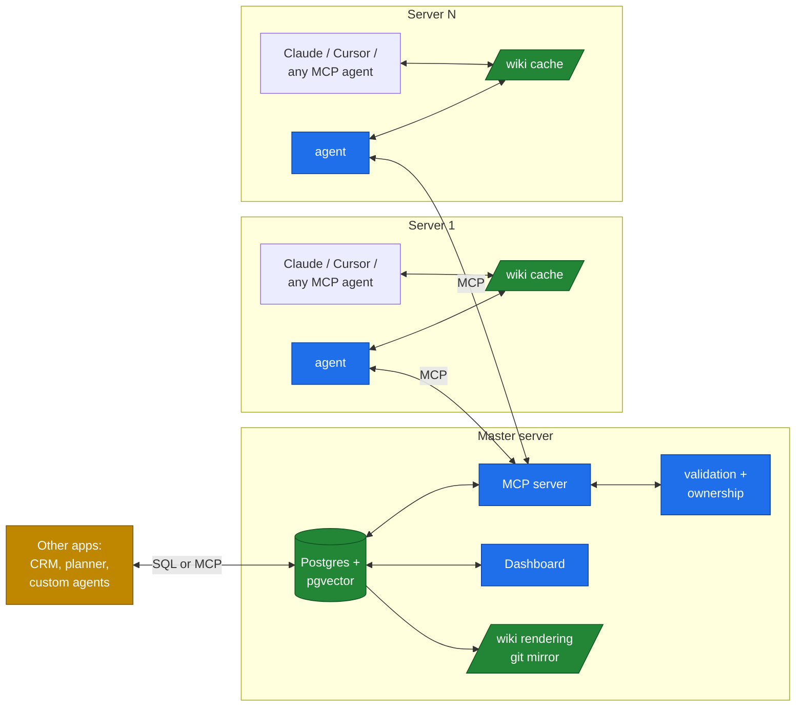

# VaultMCP

> **An MCP-first knowledge mesh for AI agents — with a serious database underneath.**

VaultMCP is a self-hosted infrastructure layer that holds your team's structured knowledge — apps, integrations, decisions, runbooks, debugging history — in a Postgres database with pgvector embeddings, exposes it through the [Model Context Protocol](https://modelcontextprotocol.io/), and broadcasts changes in real time to a small agent on each of your servers. Other applications (CRMs, calendars, custom AI agents, dashboards) can plug into the same database and build on top.

The result is a single source of truth for your AI agents *and* a shared substrate that other systems can extend — without duplicating data or running parallel knowledge stores.

---

## The 30-second pitch

**Problem.** Your team runs multiple services on multiple servers. Each engineer's AI agent (Claude Code, Cursor, …) starts every session blind to what other agents on other servers have done. Docs go stale. Slack scrolls away. RAG-over-everything hallucinates. And every new tool wants its *own* memory store.

**Solution.** One Postgres+pgvector database on a master server, exposed through MCP. Wiki content lives in DB rows (with markdown files as a synced rendering for human inspection and git history). A small agent on each server mirrors the wiki locally for instant reads and listens for real-time updates. Any MCP-aware agent reads/writes through standard tools. Other applications connect to the same DB and add their own tables — sharing the embedding store and the audit infrastructure.

**Result.** AI agents on every server share one brain. Future tools (CRM, calendar, life planner) plug into that brain instead of building parallel ones.

---

## How it feels

Open Claude Code on Server 1, working on the `webstore` app:

```
You:    What's the current schema for daily-sales batches?
Claude: (semantic-searches the wiki, finds inventory's contract, reads it)
        Here's the schema. Note that yesterday morning the inventory team
        bumped the version to require external_batch_id. Your code already
        sends it, so you're fine.
You:    Cool. Document the discount-handling we just clarified.
Claude: (writes apps/webstore/modules/discounts.md, appends to log.md)
        Done. Other servers will see this within seconds.
```

No `vs`. No `vp`. The agent on every other server immediately knows. The embedding for the new page is computed and indexed. Tomorrow, when someone asks about discounts on a different server, semantic search finds your write.

---

## Architecture, in one diagram



Four pieces:

- **Postgres + pgvector** at master — authoritative storage for content, metadata, embeddings, audit, events. Designed to be extensible: other apps add their own tables alongside.
- **MCP server** — the read/write API for agents.
- **Dashboard** — web UI for live activity, search, audit.
- **Per-server agent** — mirrors the wiki to local files, watches for local edits, syncs via MCP.

---

## Three things VaultMCP does that nothing else combines

1. **MCP-native knowledge store.** Any MCP-aware agent can read, write, search, and subscribe — without filesystem access or custom integrations.
2. **Shared, extensible substrate.** The same Postgres+pgvector that holds your wiki can hold your CRM tables, your meal planner, your job-hunt tracker. One brain, many lobes. Pattern inspired by [Open Brain (OB1)](https://github.com/NateBJones-Projects/OB1).
3. **Real-time mesh, no discipline.** Local file mirrors keep reads fast and offline-friendly. Auto-sync via MCP eliminates `vs`/`vp` rituals. A write on one server is visible everywhere within seconds.

---

## VaultMCP vs VaultMesh

VaultMCP has a sibling project: [**VaultMesh**](https://github.com/alinclaudiu/vaultmesh). Same wiki structure, same conventions, **different transport bet**.

| If you want | Use |
|---|---|
| Zero infrastructure beyond a git remote, manual `vs`/`vp` is fine, offline-first | **VaultMesh** |
| A small ops investment in exchange for real-time sync, MCP-as-API, native semantic search, an extensible shared DB, and a dashboard | **VaultMCP** |

A small org might start with VaultMesh and migrate to VaultMCP when discipline-fatigue, multi-tool fleets, or "we want to build a CRM next" enter the picture. Wiki structure ports across; only transport changes.

Full comparison: [`docs/02-vs-vaultmesh.md`](docs/02-vs-vaultmesh.md).
Extending the DB with other apps: [`docs/03-extensibility.md`](docs/03-extensibility.md).

---

## Status

**v0.0.1 — design release.** No code yet. This repo currently ships:

- A complete vision (this README)
- A full implementation-ready design ([`DESIGN.md`](DESIGN.md))
- Four architecture diagrams ([`docs/diagrams/`](docs/diagrams/))
- A "why" essay ([`docs/01-vision.md`](docs/01-vision.md))
- A comparison ([`docs/02-vs-vaultmesh.md`](docs/02-vs-vaultmesh.md))
- An extensibility guide ([`docs/03-extensibility.md`](docs/03-extensibility.md))
- A dashboard guide ([`docs/04-dashboard.md`](docs/04-dashboard.md))
- A roadmap ([`ROADMAP.md`](ROADMAP.md))

Phase 1 (working skeleton) is the next milestone. Estimated 4 focused engineer-weeks to v0.1 (a usable internal deployment).

---

## Reading order

| You are | Read |
|---|---|
| Curious, just want the gist | This README, then [`docs/01-vision.md`](docs/01-vision.md) |
| Choosing between VaultMCP and VaultMesh | [`docs/02-vs-vaultmesh.md`](docs/02-vs-vaultmesh.md) |
| Planning to build it | [`DESIGN.md`](DESIGN.md) end-to-end |
| Building an extension that uses the DB | [`docs/03-extensibility.md`](docs/03-extensibility.md) |
| Implementing the dashboard | [`docs/04-dashboard.md`](docs/04-dashboard.md) |
| Wondering about the long term | [`ROADMAP.md`](ROADMAP.md) |

---

## Attribution

VaultMCP stands on the shoulders of:

- [**VaultMesh**](https://github.com/alinclaudiu/vaultmesh) — its predecessor; wiki structure, ownership model, and conventions inherited
- [**Open Brain (OB1)**](https://github.com/NateBJones-Projects/OB1) — the DB-as-extensible-platform pattern, primitives concept, MCP+pgvector architecture
- [Andrej Karpathy's *LLM Wiki* gist](https://gist.github.com/karpathy/442a6bf555914893e9891c11519de94f) — the original LLM-maintained markdown knowledge base pattern
- [Model Context Protocol](https://modelcontextprotocol.io/) — the wire-protocol VaultMCP uses
- [pgvector](https://github.com/pgvector/pgvector) — the embedding store

Full credit: [`ATTRIBUTION.md`](ATTRIBUTION.md).

---

## License

MIT.
