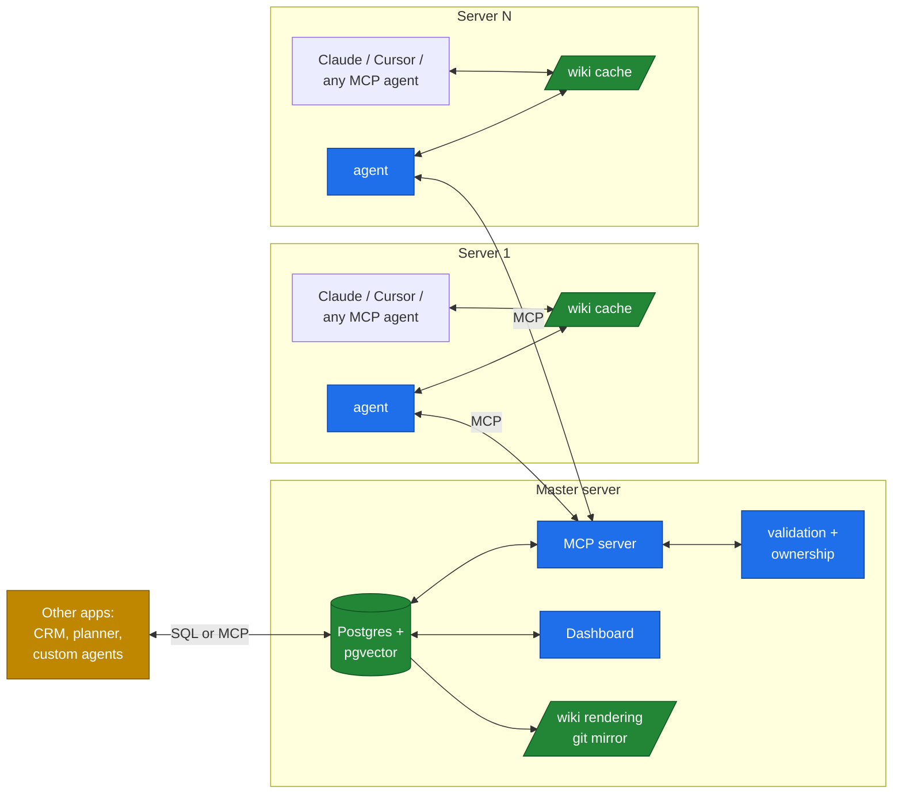

# VaultMCP

> **An MCP-first knowledge mesh for AI agents — with a serious database underneath.**

VaultMCP is a self-hosted infrastructure layer that holds your team's structured knowledge — apps, integrations, decisions, runbooks, debugging history — in a Postgres database with pgvector embeddings, exposes it through the [Model Context Protocol](https://modelcontextprotocol.io/), and broadcasts changes in real time to a small agent on each of your servers. Other applications (CRMs, calendars, custom AI agents, dashboards) can plug into the same database and build on top.

The result is a single source of truth for your AI agents *and* a shared substrate that other systems can extend — without duplicating data or running parallel knowledge stores.

---

## The 30-second pitch

**Problem.** Your team runs multiple services on multiple servers. Each engineer's AI agent (Claude Code, Cursor, …) starts every session blind to what other agents on other servers have done. Docs go stale. Slack scrolls away. RAG-over-everything hallucinates. And every new tool wants its *own* memory store.

**Solution.** One Postgres+pgvector database on a master server, exposed through MCP. Wiki content lives in DB rows (with markdown files as a synced rendering for human inspection and git history). A small agent on each server mirrors the wiki locally for instant reads and listens for real-time updates. Any MCP-aware agent reads/writes through standard tools. Other applications connect to the same DB and add their own tables — sharing the embedding store and the audit infrastructure.

**Result.** AI agents on every server share one brain. Future tools (CRM, calendar, life planner) plug into that brain instead of building parallel ones.

---

## How it feels

Open Claude Code on Server 1, working on the `webstore` app:

```
You:    What's the current schema for daily-sales batches?
Claude: (semantic-searches the wiki, finds inventory's contract, reads it)
        Here's the schema. Note that yesterday morning the inventory team
        bumped the version to require external_batch_id. Your code already
        sends it, so you're fine.
You:    Cool. Document the discount-handling we just clarified.
Claude: (writes apps/webstore/modules/discounts.md, appends to log.md)
        Done. Other servers will see this within seconds.
```

No `vs`. No `vp`. The agent on every other server immediately knows. The embedding for the new page is computed and indexed. Tomorrow, when someone asks about discounts on a different server, semantic search finds your write.

---

## Architecture, in one diagram



Four pieces:

- **Postgres + pgvector** at master — authoritative storage for content, metadata, embeddings, audit, events. Designed to be extensible: other apps add their own tables alongside.
- **MCP server** — the read/write API for agents.
- **Dashboard** — web UI for live activity, search, audit.
- **Per-server agent** — mirrors the wiki to local files, watches for local edits, syncs via MCP.

---

## Three things VaultMCP does that nothing else combines

1. **MCP-native knowledge store.** Any MCP-aware agent can read, write, search, and subscribe — without filesystem access or custom integrations.
2. **Shared, extensible substrate.** The same Postgres+pgvector that holds your wiki can hold your CRM tables, your meal planner, your job-hunt tracker. One brain, many lobes. Pattern inspired by [Open Brain (OB1)](https://github.com/NateBJones-Projects/OB1).
3. **Real-time mesh, no discipline.** Local file mirrors keep reads fast and offline-friendly. Auto-sync via MCP eliminates `vs`/`vp` rituals. A write on one server is visible everywhere within seconds.

---

## VaultMCP vs VaultMesh

VaultMCP has a sibling project: [**VaultMesh**](https://github.com/alinclaudiu/vaultmesh). Same wiki structure, same conventions, **different transport bet**.

| If you want | Use |
|---|---|
| Zero infrastructure beyond a git remote, manual `vs`/`vp` is fine, offline-first | **VaultMesh** |
| A small ops investment in exchange for real-time sync, MCP-as-API, native semantic search, an extensible shared DB, and a dashboard | **VaultMCP** |

A small org might start with VaultMesh and migrate to VaultMCP when discipline-fatigue, multi-tool fleets, or "we want to build a CRM next" enter the picture. Wiki structure ports across; only transport changes.

Full comparison: [`docs/02-vs-vaultmesh.md`](docs/02-vs-vaultmesh.md).
Extending the DB with other apps: [`docs/03-extensibility.md`](docs/03-extensibility.md).

---

## Status

**v0.6.0 — Hardening release.** All ROADMAP phases v0.1 → v0.6 land:

| Phase | What works | Tag |
|---|---|---|
| v0.2 | master + per-server agent + real-time SSE + offline write queue | `v0.2.0` |
| v0.3 | bearer-token auth + per-server-app + path-level ownership + validation (size/encoding/frontmatter/secrets) + `wiki.audit` | `v0.4.0` |
| v0.4 | lexical / semantic / hybrid search via Reciprocal Rank Fusion + pgvector embedding worker + 5-page HTMX dashboard with HTTP Basic gate + SSE-driven live activity | `v0.4.0` / `v0.4.1` |
| v0.5 | `ext.register / declare_table / query / exec / embed / emit_event` for other apps to share the DB; real Postgres-role isolation per extension | `v0.5.0` / `v0.6.0` |
| v0.6 | backup runbook, perf baseline, graceful-shutdown fix, role-isolation hardening | `v0.6.0` |

**Tests:** 143 passing (113 unit + 30 e2e against a real Postgres + pgvector).

**Perf baseline** (single-client sequential, dev box, [`deploy/PERFORMANCE.md`](deploy/PERFORMANCE.md)):

| Op | p50 | p95 | throughput |
|---|---:|---:|---:|
| `wiki.write` | 5.6 ms | 6.4 ms | ~175 writes/s |
| `wiki.read` | 2.5 ms | 3.6 ms | ~371 reads/s |
| `wiki.search` (lexical) | 4.7 ms | 5.3 ms | ~218 searches/s |

**Production status:** v0.6.0 has been driven through a real first-deploy: master on one host, agent on a remote LAN host, propagation verified end-to-end. Deployment recipe at [`deploy/README.md`](deploy/README.md), backup at [`deploy/BACKUP.md`](deploy/BACKUP.md). The bug list discovered during that deploy (graceful-shutdown deadlock with active SSE subscribers, permission errors on protected config files) is fixed in `main`.

What's *not* yet in: official MCP transport (stdio + streamable-HTTP) — the master currently exposes its tools via JSON-over-HTTP at `/mcp/call`; the SDK adapter is queued. Federation, multi-master replicas, and ingest tools (Web Clipper, etc.) are v1.x stretch.

---

## Quick start

You'll need Postgres 15+ with the pgvector extension package installed. See [`deploy/README.md`](deploy/README.md) for the full production walkthrough.

**On the master host:**

```bash
# 1. One-time superuser setup (Postgres + pgvector + role privileges)
sudo -u postgres psql <<SQL
  CREATE ROLE vaultmcp LOGIN PASSWORD 'change-me' CREATEROLE;
  CREATE DATABASE vaultmcp OWNER vaultmcp;
SQL
sudo -u postgres psql -d vaultmcp -c "CREATE EXTENSION vector;"

# 2. Install the package + create system user + dirs
sudo useradd --system --no-create-home vaultmcp
sudo install -d -o vaultmcp -g vaultmcp -m 0750 /srv/vaultmcp /srv/vaultmcp/wiki
python3 -m venv /opt/vaultmcp/venv
sudo /opt/vaultmcp/venv/bin/pip install vaultmcp   # or: /path/to/this/repo

# 3. Configure + install systemd unit
sudo cp deploy/master.env.example /srv/vaultmcp/master.env
sudoedit /srv/vaultmcp/master.env  # fill in DSN, set VAULTMCP_HTTP_HOST=<lan-ip>
sudo cp deploy/master.service /etc/systemd/system/vaultmcp-master.service
sudo systemctl daemon-reload && sudo systemctl enable --now vaultmcp-master

# 4. Issue a token for the first agent server
sudo -u vaultmcp env $(sudo cat /srv/vaultmcp/master.env | grep -v '^#' | xargs) \
  /opt/vaultmcp/venv/bin/vaultmcp-master add-server --id MyServer --apps myapp,shared
```

The token is printed once. Save it.

**On each agent host:**

```bash
# 1. Install
git clone https://github.com/alinclaudiu/vaultmcp ~/projects/vaultmcp
python3 -m venv ~/.local/share/vaultmcp-venv
~/.local/share/vaultmcp-venv/bin/pip install -e ~/projects/vaultmcp

# 2. Configure
mkdir -p ~/vault ~/.config/vaultmcp ~/.config/systemd/user
cat > ~/.config/vaultmcp/agent.env <<EOF
VAULTMCP_MASTER_URL=http://<master-lan-ip>:8080
VAULTMCP_SERVER_ID=MyServer
VAULTMCP_APP=myapp
VAULTMCP_TOKEN=<token-from-add-server>
VAULTMCP_VAULT_DIR=$HOME/vault
EOF
chmod 600 ~/.config/vaultmcp/agent.env

# 3. systemd --user unit + start
cp ~/projects/vaultmcp/deploy/agent.service ~/.config/systemd/user/
sed -i "s|ExecStart=.*|ExecStart=$HOME/.local/share/vaultmcp-venv/bin/vaultmcp-agent run|" \
    ~/.config/systemd/user/agent.service
systemctl --user daemon-reload
systemctl --user enable --now vaultmcp-agent
```

Drop a markdown file under `~/vault/apps/myapp/` and watch it land on the master at `/srv/vaultmcp/wiki/apps/myapp/` within a second or two. The dashboard at `http://<master-ip>:8080/` shows the activity live (gate it behind `VAULTMCP_DASHBOARD_PASSWORD` before exposing).

---

## Reading order

| You are | Read |
|---|---|
| Curious, just want the gist | This README, then [`docs/01-vision.md`](docs/01-vision.md) |
| Choosing between VaultMCP and VaultMesh | [`docs/02-vs-vaultmesh.md`](docs/02-vs-vaultmesh.md) |
| Deploying for the first time | [`deploy/README.md`](deploy/README.md) |
| Setting up backups | [`deploy/BACKUP.md`](deploy/BACKUP.md) |
| Sizing for prod | [`deploy/PERFORMANCE.md`](deploy/PERFORMANCE.md) |
| Building an extension that uses the DB | [`docs/03-extensibility.md`](docs/03-extensibility.md) |
| Implementing or extending the dashboard | [`docs/04-dashboard.md`](docs/04-dashboard.md) |
| Reading the architecture | [`DESIGN.md`](DESIGN.md) |
| Wondering about the long term | [`ROADMAP.md`](ROADMAP.md) |
| Operating day-to-day | the project's CLAUDE.md (kept up to date for AI agents working on the repo) |

---

## Attribution

VaultMCP stands on the shoulders of:

- [**VaultMesh**](https://github.com/alinclaudiu/vaultmesh) — its predecessor; wiki structure, ownership model, and conventions inherited
- [**Open Brain (OB1)**](https://github.com/NateBJones-Projects/OB1) — the DB-as-extensible-platform pattern, primitives concept, MCP+pgvector architecture
- [Andrej Karpathy's *LLM Wiki* gist](https://gist.github.com/karpathy/442a6bf555914893e9891c11519de94f) — the original LLM-maintained markdown knowledge base pattern
- [Model Context Protocol](https://modelcontextprotocol.io/) — the wire-protocol VaultMCP uses
- [pgvector](https://github.com/pgvector/pgvector) — the embedding store

Full credit: [`ATTRIBUTION.md`](ATTRIBUTION.md).

---

## License

MIT.
